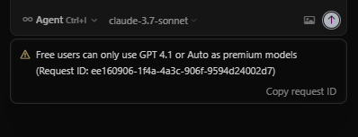

# Cursor Pro Free Premium

This is an enhancement tool for the Cursor editor. It can not only clean Cursor's data files, but also reset the machine code and break the Claude 3.7 Sonnet limit. (If you have any questions, feel free to leave me a message

## Main Features

* **Reset Machine Code** - Reset Cursor's usage limit by generating a random machine ID
* **Break Claude 3.7 Sonnet Limit** - Enable advanced features and break the free version limit
* **Clean Cursor Application Data** - Clean history and cache files, including:
  * Delete `globalStorage/state.vscdb` and `globalStorage/state.vscdb.backup` files
  * Empty all contents in the `History` folder
  * Delete the `workspaceStorage` folder and its contents
* **Terminate Cursor Processes** - Quickly close all Cursor-related processes

## Problem Solving

When you encounter the following problems, this tool can help you solve them:



> **Note**: If you still encounter limits after operation, it may be due to IP contamination. It is recommended to try again after changing your IP (some users have already encountered this situation). You can try resetting several times.

## Usage Guide

### Windows System

#### GUI Version

1. Download the latest `cursor_enhance_tool.zip` and extract it
2. Right-click `cursor_enhance_tool.exe` and select "**Run as administrator**"
3. In the pop-up GUI, select the required function:
   - Reset machine code
   - Break Claude 3.7 Sonnet limit
   - Clean Cursor application data
   - Terminate Cursor processes

#### Command Line Version (Old Version)

1. Right-click `cursor_clean.exe` and select "**Run as administrator**"
2. Follow the command line prompts to select operation options

### Mac System

#### Using the Python Script

1. Open Terminal
2. Go to the directory where the script is located
3. Run the following command to execute the script:
```
sudo python3 cursor_clean_mac.py
```

> **Note**: On Mac, the program requires administrator privileges to run because it needs to access system-protected files.

## Usage Demo

Below is a demo video of the tool (old version interface, new version is GUI):

[Click to download and watch the video](20250530_005756.mp4)

<video width="640" height="360" controls>
  <source src="20250530_005756.mp4" type="video/mp4">
  Your browser does not support the video tag
</video>

## Configuration File

### Windows System

The program will automatically create a `config.env` configuration file. You can modify the path settings as needed:

```ini
[PATHS]
# Cursor user data directory path
base_path = C:\Users\YourUsername\AppData\Roaming\Cursor\User
```

The configuration file needs to be placed in the same directory as the executable file.

### Mac System

The program will automatically create a `config_mac.env` configuration file. You can modify the path settings as needed:

```ini
[PATHS]
# Cursor user data directory path
base_path = ~/Library/Application Support/Cursor/User
```

The configuration file needs to be placed in the same directory as the script or executable file.

## Disclaimer

This tool is for learning and research purposes only. Do not use it for commercial purposes. Any problems arising from the use of this tool are the user's own responsibility. Please back up important Cursor configurations before use.# cursor-pro-free
